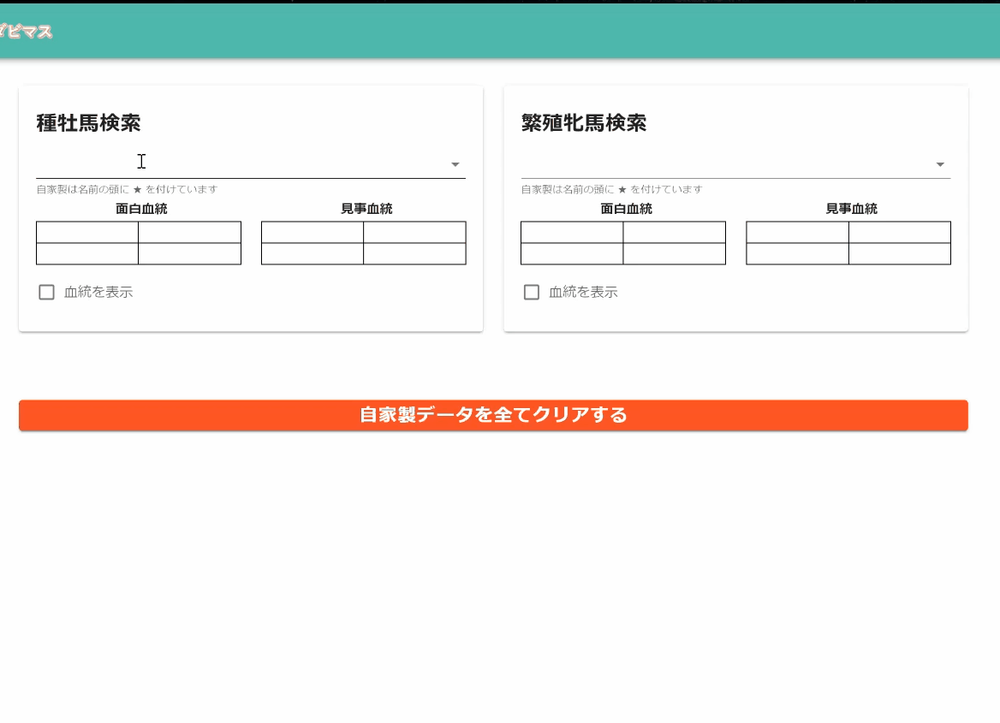
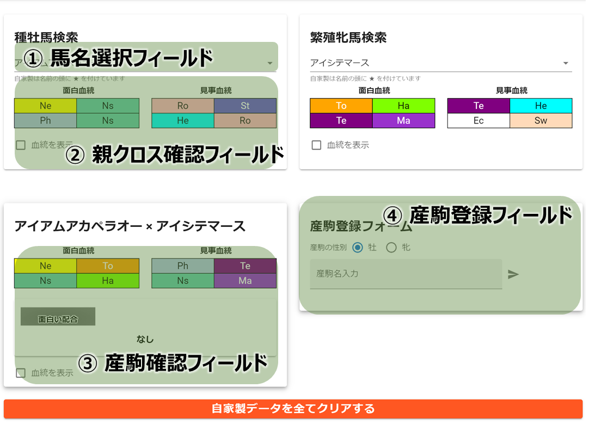
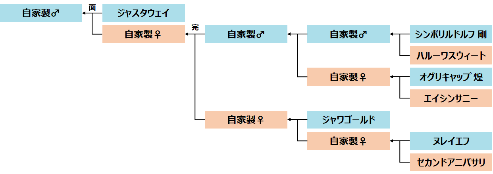

# オリジナル血統デザイナー for ダビマス
### <b><U>DEMO</U></b>

|| 
|:--:| 
| Fig.1 アプリケーションデモ |

##  概要
本アプリはダービースタリオンマスターズ（以下ダビマス）の配合サポートツールです。

強い馬を生産する上で，馬の血統や配合理論を意識した配合はとても重要です。 
そのため，１頭を生産するために膨大な馬が関わる配合チャートが必要になります。 
しかし，公式のサポートツールでは配合チャートの検証が十分にできず，予定通りのクロスにならなかったり，危険な配合となる”事件”が後を絶ちません。 
このツールは，そんなダビマサーに向けた配合サポートツールです。 

##  利用開始まで
本アプリは<b>特別な準備なく</b>，一般的なインターネットブラウザを介して手軽に利用が可能です。 
動作はSafari，Google Chromeにて確認済です。その他は未検証です。 

また，本アプリはスマホのアプリケーションの様に動作させることも可能です。 
サイトアクセス時に提示される「ホーム画面に追加」を選択することで，機能をお楽しみいただけます。 
PC，Android，iphone / iPadにおける詳細な導入方法は下記のサイトを参照の上，各自で確認願います。 
https://support.google.com/chrome/answer/9658361

 利用手順の詳細 

##  利用方法
本アプリの画面をFig.2に示します。 
このうち，③ 産駒確認フィールド，④産駒登録フィールドは初期状態では描画されていません。 
| | 
|:--:| 
| Fig.2 操作画面 |

### -手順-
1. 馬名選択フィールドに，配合したい両親の名前を入力し選択
2. 両親が選択された場合，産駒確認フィールド，産駒登録フィールドが自動で描画
3. 産駒確認フィールドにて，配合理論（完璧な配合，面白い配合等）やクロス，血統等を確認
4. 産駒を親馬とする場合，産駒登録フィールド「産駒名入力」に名前を入力
5. "★ (産駒名)が正常に登録されました"と表示されれば，登録完了
6. 産駒を削除する場合，「自家製データをすべてクリアする」を選択

### -諸注意-

* 産駒は，Webブラウザ本体のローカルデータベースに保存されます。 このため，ブラウザのキャッシュクリア等で登録された産駒が消える可能性があります。
* 結果や産駒情報のバックアップ・ダウンロード機能は今のところ実装を予定しておりません。
* 配合結果は作成者が推測したアルゴリズムに基づくため，ゲーム内結果と異なる場合があります。
* 配合ミス等，本アプリケーションの結果に起因する如何なる被害に対しても，作成者はその責を負うものではありません。個人の判断に基づき利用してください。

##  開発環境
* OS：Windows 10 Home
* lang：Javascript + Vue.js + Vuetify
* 検証環境：Google Chrome + 開発者ツール

##  開発ロードマップ
本アプリは配合総合サポートツールを目指しています。 
そのため，配合補助だけでなく，配合チャート確認ツールや配合計画支援ツールも製作予定です。 

### - <b>配合チャート確認ツール</b> -：

配合チャート確認ツールとは

ゲーム内の配合掲示板のように「どの馬を，いつ掛け合わせるか」が一目で分かるツールです。 
現在開発は未着手ですが，クロス間違いや危険な配合予防には「配合シミュレータ」と「配合チャート確認ツール」が一体となることが重要だと考えており，今後の実装を予定しています。 
  
| | 
|:--:| 
| Fig.3 配合チャート確認ツールのラフスケッチ |
  

### - <b>配合計画支援ツール</b> - ：

配合計画支援ツールとは

配合チャートに基づき「どの馬を，どのタイミングで」生産するかを決定する配合計画を支援するツールです。

今までは，配合チャート作成→実行のギャップに潜む問題を解決するアプリケーションを紹介しました。 
一方で，特に，種側を薄める操作を伴う配合における問題はもう１つ存在します。 
<B>種側の作成タイミングをいつにするか</B>，です。

配合チャートを確認しつつ，牝馬と並行して牡馬を育てる作業は非常な苦労を伴い，この結果として<b>配合のし忘れ</b>をしてしまい，決して安くはない種ポイントをドブに捨てざるを得なかった人は少なくないと思います。 
このような問題に対し，牡馬の育成見積もり期間，牝馬の生産期間に基づき配合の投入順序を決めるサポートアプリケーションの開発を計画しています。 

##  開発協力に関するご依頼
本アプリは現状，開発者が１名のため，実現可能な機能・UXには限界があります。 
また，ダビマスは親馬の追加が頻繁であり，血統情報の調査には工数を要します。 
本アプリケーションの継続に向け，コーディング・実装に関わってくださる方や，要望を出してくださる方，データを更新してくださる方を常に募集しています。 詳細はお問い合わせください。

なお，本アプリ開発の理念は，「<b>Do it yourself</b>」です。 
要望に沿えない場合が多々ございますが，予めご承知おきください。

##  問い合わせ先
|  開発者  |  連絡先 / Twitter  |  コメント  |
| :----: | :----: | :---- |
|  鉱山夫組合牧場  |  @db_mpros  |  jsとhtmlをイチから始めて１週間でアプリってできるんだと思いました。  |
